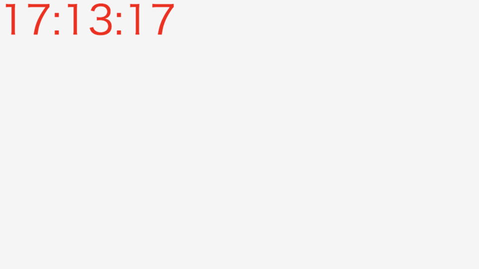

# CreateJS でデジタル時計の開発に挑戦しよう

デジタル時計の作成を通して、CreateJSの理解を深めましょう。

## テキストの表示

デジタル時計の作り方ですが、`createjs.Text`クラスを使います。見栄えはさておき、現在時刻を表示させてみましょう。



- [サンプルを再生する](https://ics-creative.github.io/tutorial-createjs/samples/clock_digital_simple.html)
- [サンプルのソースコードを確認する](../samples/clock_digital_simple.html)

ポイントとしては、`createjs.Text`インスタンスは一度だけ作成し、そのインスタンスの`text`プロパティーを変更することです。詳しくは[テキストの解説](text.md)の「テキストの文言を変更する」段落を参照ください。

```js
// Text インスタンスを作成
var label = new createjs.Text("", "80px sans-serif", "red");
// Text インスタンスは一度だけしか stage に追加しない
stage.addChild(label);

// 時間経過のイベント
createjs.Ticker.addEventListener("tick", handleTick);
function handleTick() {
  // (省略)
  // Text インスタンスの文字列を更新
  label.text = ◯◯◯;
  // (省略)
}
```

時・分・秒の文字列を結合したい場合は`+`演算子を使って記述します。コロン（:）は文字列として表示させたい場合は、ダブルクオテーションを使って`":"`と記述します。

```js
// 現在時間を取得
var now = new Date();

// 時間の数値を取得
var h = now.getHours(); // 時(0〜23)
var m = now.getMinutes(); // 分(0〜59)
var s = now.getSeconds(); // 秒(0〜59)

// 表示文言を作成
var time = h + ":" + m + ":" + s;
// Text インスタンスの文字列を更新
label.text = time;
```


ありがちな失敗例も紹介しましょう。`tick`イベントで`createjs.Text`インスタンスを追加し続けると、残像効果のような表示になってしまいます。文言を変化させたいときは`text`プロパティーを更新するようにしましょう。


失敗例のコード

```js
// 時間経過のイベント
createjs.Ticker.addEventListener("tick", handleTick);
function handleTick() {
  // (省略)
  // Text インスタンスを作成
  var label = new createjs.Text(◯◯◯, "80px sans-serif", "red");
  stage.addChild(label);
  // (省略)
}
```


[アナログ時計の記事へ](clock_digital.md)

<article-author>[池田 泰延](https://twitter.com/clockmaker)</article-author>
<article-date-published>2016-10-24</article-date-published>
<article-date-modified>2016-10-24</article-date-modified>
